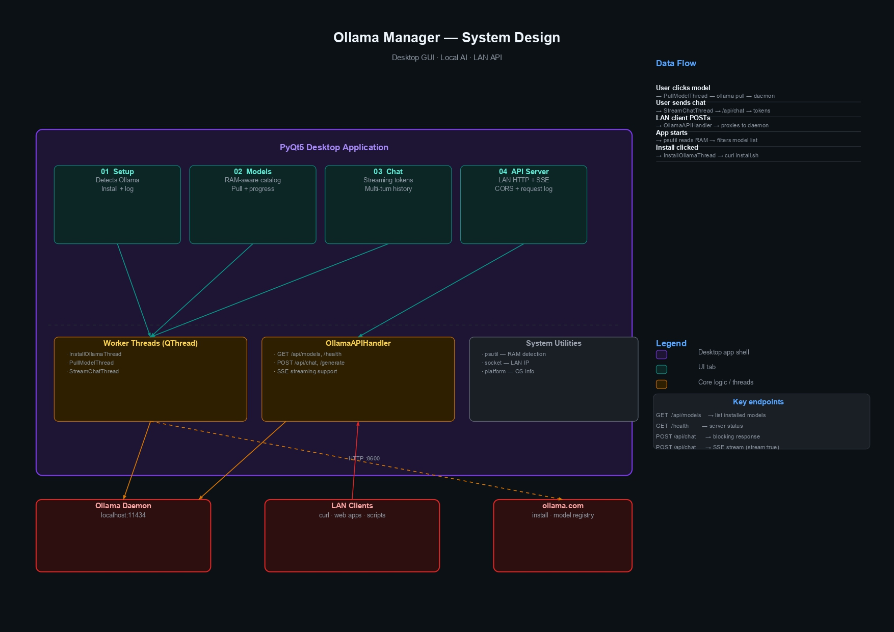

# 🦙 Ollama Manager

> A free, open-source desktop GUI for running AI models locally — no terminal, no cloud, no API keys. It detects your system RAM, shows only compatible models, and lets you chat, pull models, and expose a LAN API server, all from one clean window.

---

## 🚀 What is this?

**Ollama Manager** is a free, open-source Python desktop app that gives anyone — developers, students, researchers, or the simply curious — a beautiful interface to run large language models (LLMs) **entirely on their own machine**.

No API keys. No cloud costs. No data leaving your device.

Built on top of [Ollama](https://ollama.com), it wraps the entire workflow into a clean 4-tab GUI so you can go from zero to chatting in under 5 minutes.

---

## ✨ Features

### 01 · Setup
- Detects whether Ollama is installed on your machine
- One-click install via the official script with a live log view
- Shows your system RAM and OS details upfront

### 02 · Models
- **Automatically shows only models your machine can run** — based on your detected RAM
- Filter by name or tag to find the right model for your use case
- Pull any model from `ollama.com/library` using the custom input — not limited to the built-in list
- RAM and disk size shown per model so you always know what you're getting into
- Progress bar during download

### 03 · Chat
- Full **streaming token output** (responses appear word-by-word, just like ChatGPT)
- Multi-turn conversation history maintained per session
- Switch between any installed model on the fly
- Clear chat and start fresh anytime

### 04 · API Server
- Spin up a **LAN-accessible HTTP API** on any port (default: 8600)
- Supports both **blocking** and **streaming SSE** modes
- CORS enabled — connect from any browser app, script, or tool on your network
- Live request log so you can see exactly what's hitting your server
- Endpoint docs shown directly in the UI

---

## 🖥️ System Requirements

| Component | Minimum |
|-----------|---------|
| OS | Windows / macOS / Linux |
| Python | 3.8+ |
| RAM | 4 GB (8 GB recommended for 7B models) |
| Dependencies | PyQt5, psutil, requests |

---

## ⚡ Quick Start

```bash
# 1. Clone the repo
git clone https://github.com/YOUR_USERNAME/ollama-manager
cd ollama-manager

# 2. Install dependencies
pip install PyQt5 psutil requests

# 3. Run
python ollama_manager.py
```

> Ollama itself will be installed automatically from inside the app if it isn't detected.

---


## 🏗️ System Design
 

 
Worker threads handle all long-running operations (install, model pull, chat streaming) so the UI never freezes. The model list is filtered at runtime based on your system's available RAM. The built-in API server proxies requests to Ollama with CORS support and SSE streaming.
 
---

## 📡 API Usage

Once the API server is running, anyone on your local network can use it:

**Blocking request:**
```bash
curl -X POST http://YOUR_LAN_IP:8600/api/chat \
  -H "Content-Type: application/json" \
  -d '{"model":"mistral","prompt":"What is recursion?"}'
```

**Streaming (SSE):**
```bash
curl -X POST http://YOUR_LAN_IP:8600/api/chat \
  -H "Content-Type: application/json" \
  -d '{"model":"mistral","prompt":"Explain quantum computing","stream":true}'
# Each chunk: data: {"response":"...","done":false}
# Final:       data: [DONE]
```

**Available endpoints:**
| Method | Path | Description |
|--------|------|-------------|
| GET | `/health` | Server status + active model |
| GET | `/api/models` | List installed models |
| POST | `/api/chat` | Generate (blocking or stream) |
| POST | `/api/generate` | Alias for `/api/chat` |

---

## 🤝 Contributing

Contributions are welcome! Here are some ideas for what could be next:

- [ ] Model benchmarking / speed test tab
- [ ] System prompt / persona editor
- [ ] Export chat history to Markdown
- [ ] GPU usage monitoring
- [ ] Multi-model comparison (side-by-side responses)
- [ ] Dark / light theme toggle

Feel free to open an issue or submit a PR.

---

## 📄 License

MIT — use it, fork it, build on it.

---

## 🙏 Acknowledgements

Built on top of the incredible [Ollama](https://ollama.com) project.  
Models from Meta, Mistral AI, Google, Microsoft, Alibaba, and DeepSeek.

---

*Made with ❤️ for anyone who believes AI should run on your own hardware.*
